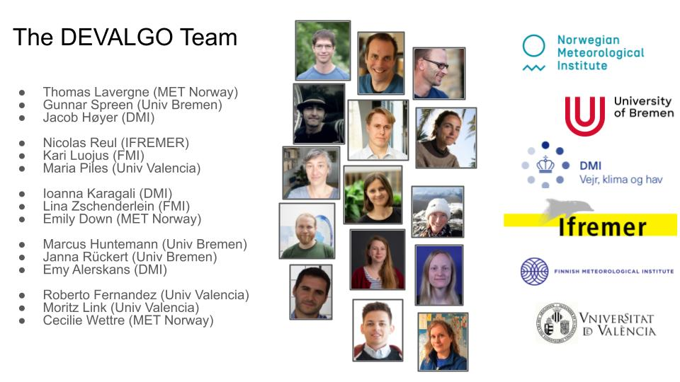

## The ESA CIMR DEVALGO study

This page is the entry-point for the Level-2 ATBDs (Algorithm Theoretical Basis Document) produced by the ESA CIMR DEVALGO study.

The CIMR DEVALGO study was a 2-year ESA-funded study (2022-2024) funded to develop prototype ATBDs for a selection of CIMR Level-2 products.

> [!CAUTION]
> This ESA study is now finished. The material you will find below, including the ATBDs and prototype software, are a snapshot at the end of the project.
>
> The work has since continued in the context of [ESA CIMR L2PAD](https://github.com/CIMR-L2PAD/) project (2024-2027).

### ATBDs

The Level-2 ATBDs developed by the CIMR DEVALGO study, sorted by Level-2 Product families, are:
* Polar Regions and Adjacent Seas:
   * [Level-2 Sea Ice Concentration, Sea Ice Edge, and SIC in NRT1H v2](https://cimr-algos.github.io/SeaIceConcentration_ATBD_v2/book/intro.html) 
   * [Level-2 Sea Ice Drift v2](https://cimr-algos.github.io/SeaIceDrift_ATBD_v2/intro.html)
   * [Level-2 Sea Ice Thickness v2](https://cimr-algos.github.io/SeaIceThickness_ATBD_V2/intro.html)
   * [Level-2 Sea Surface Temperature v1](https://cimr-algos.github.io/SeaSurfaceTemperature_ATBD/intro.html) 
   * [Level-2 Sea Surface Salinity v2](https://cloud.ifremer.fr/index.php/s/35SmeaCYxPyrf2A)
   * [Level-2 Ocean Wind Vectors v2](https://cloud.ifremer.fr/index.php/s/YwT3rlxGxLaC39a)
* Global Land:
   * [Level-2 Terrestrial Snow Area v1](https://cimr-algos.github.io/TerrestrialSnowArea_ATBD/intro.html)
   * [Level-2 Soil Moisture v2](https://cimr-algos.github.io/SoilMoisture_ATBD_v2/intro.html)
     

In addition, a [Multi-Parameter Retrieval for Polar Ocean, Sea Ice, and Atmosphere variables v2](https://cimr-algos.github.io/MultiParameter_ATBD_V2/intro.html) ATBD is developed.

:warning: **Pre-requisite (for Level-1B)** : Our Level-2 ATBDs (specifically the SSS and OWV ATBDs) described relevant TB correction algorithms that **will eventually be implemented in the Level-1B** (and not at Level-2). We include these steps as a reference, but they shall eventually be defined in the CIMR Level-1B ATBD. These include but are not limited to:
* Corrections for the sky and Sun direct and Earth reflected/scattered radiation (L-band) [[Sunglint in ATBD](https://cimr-algos.github.io/SeaSurfaceSalinity_ATBD/baseline_algorithm_definition.html#sea-surface-scattered-solar-sunglint-contributions)] and [[Sky/Galaxy in ATBD](https://cimr-algos.github.io/SeaSurfaceSalinity_ATBD/baseline_algorithm_definition.html#sea-surface-scattered-celestial-sky-radiation-contribution)];
* Faraday rotation across the ionosphere (L-band) [[link to the ATBD](https://cimr-algos.github.io/SeaSurfaceSalinity_ATBD/baseline_algorithm_definition.html#faraday-rotation-angle)];
* Rotation of the Stokes parameter from the antenna polarization basis to the surface polarization basis (all bands) [[link to the ATBD](https://cimr-algos.github.io/SeaSurfaceSalinity_ATBD/baseline_algorithm_definition.html#total-rotation-from-surface-basis-to-antenna-basis)];
* RFI detection, filtering and mitigation (all bands).

Repositories holding the content (document, figures, prototype software) of the ATBDs are at the bottom of this page.

### Background

CIMR is the Copernicus Imaging Microwave Radiometer mission, a multi-frequency, conically-scanning passive microwave imager
designed by ESA to support EU's Arctic Policy, among others. Its launch is scheduled in 2029/30.
More info about CIMR [here](https://www.esa.int/Applications/Observing_the_Earth/Copernicus/CIMR).

### Objectives and Concept

CIMR DEVALGO developed selected CIMR Level-2 ATBDs in the form of [jupyterbooks](https://jupyterbook.org/en/stable/intro.html). The aim of the study was to:

> Provide baseline Level-2 retrieval Algorithm Theoretical Baseline Documents (ATBD)  - and supporting prototype software and validation data - for the CIMR Mission.

ATBDs were developed in two stages:
* v1 ATBDs described the selected algorithm and expected input/output data streams.
* v2 ATBDs further described the algorithm, added an open-source software prototype of the algorithm, and perform performance evaluation.

### The DEVALGO Team

The DEVALGO team was led by Thomas Lavergne from the Norwegian Meteorological Institute (NO). The consortium partners were the University of Bremen (DE),
the Danish Meteorological Institute (DK), IFREMER (FR), and the Finnish Meteorological Institute (FI).

